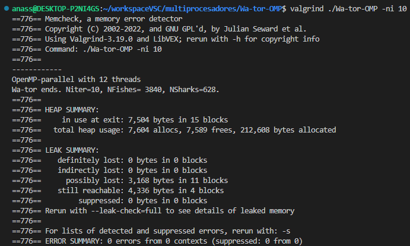

# Ejercicio: Wa-tor OMP.

# A rellenar por el alumno/grupo

- Nombre y apellidos alumno 1 : Daniel Pérez Valverde
- Nombre y apellidos alumno 2 : Anass El Jabiry Kaddir
- Mayoría en GTA1, GTA2 o GTA3 : GT3 y GT1 respectivamente
- Nombre de grupo de actividades: Grupo 58

## Arquitectura:

- Microprocesador: `AMD Ryzen 7 5800X 8-Core Processor`
- Número de núcleos: `8`
- Cantidad de subprocesos por nucleo: `2`
- Tiene hyperthreading (SMT) activado en BIOS: `No`
- HDD/SDD: `931Gb`
- RAM: `15Gb`
- Se usa máquina virtual: `No`

# Instrucciones:

- Buscar "TODO" en los ficheros:

```console
$ grep -n TODO *
```

- En el Run.sh se tienen los comandos a ejecutar para
  - -r 102 -c 102 y -ni 10000 con distinto número de hebras y
  - -r 201 -c 201 -ni 10000.
- Hay que asegurarse que el número de iteraciones final realizadas por el programa sean **10000**, es decir deben quedar peces y tiburones después de la ejecución para obtener tiempos.
- Cuando se miden tiempos, no se usaran las salidas gráficas o de datos de gnuplot. Solo se usarán para chequear que el programa paralelo funciona como el secuencial. Hay que quitar el PRINT=1 y poner PRINT=0, ya que la salida por pantalla consume mucho tiempo. Hay que compilar sin el -g ni el -pg ya que no se está depurando ni haciendo un profiling.

- Debido a la complejidad de evitar el acceso de varias hebras a una celda, la inicialización del océano con peces y tiburones se hará por una sola hebra.
- Cada hebra usará su secuencia de números aleatorios con ldrand48_r() para el movimiento de los peces y tiburones.
- Los números aleatorios se inicializaran con srand48(0).
- Hay que tener cuidado con los contadores del numero de peces y de tiburones en la rutina IterateOcean.
  - Se pueden hacer reducciones. Usad variables locales que se inicializan a *pNFishes y *pNSharks y luego después de los reduction ya actualizadas se vuelven a asignar a *pNFishes y *pNSharks. Si se hace con #pragma omp critical se obtiene menos nota.
- Hay que tener en cuenta que para evitar secciones críticas, cuando una celda se visita por una hebra, las que dependen de ella, (las del alrededor) no pueden ser visitadas por otra hebra.
- Una solución que evita secciones críticas es desenrollar los bucles para evitar condiciones de carrera. Si se fuerza que el tamaño del océano sea múltiplo de 3 en filas y columnas, se podría tener, por ejemplo:
  - Tres bucles dobles con i=0,1,2; i < rows; i=i+3 cada uno y su respectivo bucle j para todas las columnas, donde cada hebra haría una fila completa, que estaría separada de otra fila en otra hebra por al menos tres filas, evitando conflictos.
  - Nueve bucles, donde se realiza lo mismo que antes pero también para las columnas.

Ejemplo de tres bucles dobles para **rows=cols=9**. Cada hebra se hace cargo de una fila, cuyas celdas están marcadas con x. Las acciones en una celda solo afectan a las de alrededor, que no pueden visitarse por otra hebra dentro del doble bucle. Se habrán visitado todas las celdas al finalizar los tres dobles bucles.

---

- **i=0**; i < rows; **i=i+3**
- > j=0; j < cols ; j++

| +   | 0   | 1   | 2   | 3   | 4   | 5   | 6   | 7   | 8   |
| --- | --- | --- | --- | --- | --- | --- | --- | --- | --- |
| 0   | x   | x   | x   | x   | x   | x   | x   | x   | x   |
| 1   |     |     |     |     |     |     |     |     |     |
| 2   |     |     |     |     |     |     |     |     |     |
| 3   | x   | x   | x   | x   | x   | x   | x   | x   | x   |
| 4   |     |     |     |     |     |     |     |     |     |
| 5   |     |     |     |     |     |     |     |     |     |
| 6   | x   | x   | x   | x   | x   | x   | x   | x   | x   |
| 7   |     |     |     |     |     |     |     |     |     |
| 8   |     |     |     |     |     |     |     |     |     |

---

- **i=1**; i < rows; **i=i+3**
- > j=0; j < cols ; j++

| +   | 0   | 1   | 2   | 3   | 4   | 5   | 6   | 7   | 8   |
| --- | --- | --- | --- | --- | --- | --- | --- | --- | --- |
| 0   |     |     |     |     |     |     |     |     |     |
| 1   | x   | x   | x   | x   | x   | x   | x   | x   | x   |
| 2   |     |     |     |     |     |     |     |     |     |
| 3   |     |     |     |     |     |     |     |     |     |
| 4   | x   | x   | x   | x   | x   | x   | x   | x   | x   |
| 5   |     |     |     |     |     |     |     |     |     |
| 6   |     |     |     |     |     |     |     |     |     |
| 7   | x   | x   | x   | x   | x   | x   | x   | x   | x   |
| 8   |     |     |     |     |     |     |     |     |     |

---

- **i=2**; i < rows; **i=i+3**
- > j=0; j < cols ; j++

| +   | 0   | 1   | 2   | 3   | 4   | 5   | 6   | 7   | 8   |
| --- | --- | --- | --- | --- | --- | --- | --- | --- | --- |
| 0   |     |     |     |     |     |     |     |     |     |
| 1   |     |     |     |     |     |     |     |     |     |
| 2   | x   | x   | x   | x   | x   | x   | x   | x   | x   |
| 3   |     |     |     |     |     |     |     |     |     |
| 4   |     |     |     |     |     |     |     |     |     |
| 5   | x   | x   | x   | x   | x   | x   | x   | x   | x   |
| 6   |     |     |     |     |     |     |     |     |     |
| 7   |     |     |     |     |     |     |     |     |     |
| 8   | x   | x   | x   | x   | x   | x   | x   | x   | x   |

## Librerias

- El paquete **netpbm-progs** (o **netpbm**) para el comando del sistema rawtoppm.
- El paquete **eog** para visualizar los ficheros .ppm.
- El paquete **gnuplot** para generar las gráficas de evolución de peces y tiburones.
- El paquete **valgrind** para chequear posibles memoria asignada y no liberada.
- El paquete **ffmpeg** para generar video raw que se visualiza con ffplay

## Objetivos

- Familiarizar al alumno con
  - El uso de OpenMP.
  - Trabajar con problemas dinámicos donde hay dependencia de datos.
  - Evitar secciones críticas con el desenrollado de bucles.
  - Uso de secuencias de números aleatorios independientes por hebra.

## Compilación

```console
$ make
```

## Ayuda parámetros

```console
$ ./Wa-tor -h
```

## Ejemplo de compilacion y ejecución

    En el script Run.sh

Wa-tor realiza una llamada a system para ejecutar **eog** (image viewer) si se le indica salida gráfica **-o** de los movimientos de los animales en el océano.

Wa-tor tambien usa el paquete **gnuplot** que hay que instalar si se le indica **-d** para general un fichero con número de peces y tiburones por iteración y mostrarlos como líneas en gratifico.

Wa-tor tambien usa el paquete **ffmpeg** que hay que instalar si se le indica el parámetro -ffmpeg para que la salida por el pipe generado la coja el comando ffmplay, generando un vídeo sin interrupciones del movimiento en el océano.

Antes de ejecutar Wa-tor hay que ver que no hay otra instancia corriendo:

```console
$ps aux  | grep Wa-tor
$ps aux  | grep eog
$ps aux  | grep gnouplot
$ps aux  | grep ffmplay

```

de **Wa-tor** o en su caso **eog**, **gnuplot**, y/o **ffmplay**. En tal caso matad el proceso necesario con:

```command
$ kill -9 <pid>
```

---

# Entrega :

- Hay que realizar la versión paralela con **tres dobles bucles** en IterateOcean().

1. **¿Tiene el algoritmo paralelo perdidas de memoria (memory leaks)?**

- Usa `$ valgrind -s ./Wa-tor-OMP -ni xx`, con xx no muy grande, ya que tarda al coger y soltar muchas veces memoria. Si tienes perdida de memoria es que dos animales se han movido a la misma celda y no está bien el código. Muestra aquí el ERROR SUMMARY.

  Sí, se produce una pérdida de memoria, aunque es mínima. Esto ocurre a pesar de que se han generado los tres bucles dobles en iterateOcean() para evitar que distintos hilos modifiquen valores que no deben. Tras realizar algunas pruebas, se ha comprobado que la pérdida de memoria es mayor cuanto mayor número de hilos se ejecuta en el programa. Por ejemplo, para dos hilos:
  
  

2. **¿Se puede hablar de speed-up teórico, según la ley de Amdahl, si en cada ejecución la semilla de la secuencia pseudo-aleatoria se inicia a un número diferente? ¿Por qué?**

- Nota: Termina el algoritmo con el mismo número de peces y tiburones para secuencial, 1 ,2 y 4 hebras? Es decir, ¿se hace el mismo trabajo en las distintas versiones de los algoritmos?

  Si se puede hablar de speed-up teórico, porque la semilla de los números aleatorios no altera la fracción secuencial del programa.

3. **Y si la semilla del lrand48() se inicializa siempre con srand48(0) y las semillas de lrand48*r() se inicializan siempre a la su posición \_i* en el vector pRandData con srand48_r(i,&pRandData[i]) ¿Se puede hablar de speed-up? ¿Por qué?**

- Nota: la misma que en el punto 2.

  No, no se puede hablar de speed-up en ese caso. El speed-up es la medida de la mejora en el rendimiento de un programa al ejecutarlo en paralelo con varios procesadores o hilos. El speed-up se calcula como el cociente entre el tiempo de ejecución secuencial y el tiempo de ejecución paralelo.

4. **Si has contestado que si se puede hablar de speed-up, rellena la siguiente tabla sin salidas gráficas ni de datos y usando siempre las mismas semillas para los números aleatorios**:

| Ejecución | 102x102 | 201x201 |
| --------- | ------- | ------- |
| T.Sec     |         |         |
| T.CsPar   |         |         |
| SpA(2)    |         |         |
| SpA(4)    |         |         |

4. **Si has contestado que si se puede hablar de speed-up, ¿Donde has medido el tiempo del código secuencial que se va a paralizar (T.CsPar) para calcular SpA(p)?**

5. **A partir de la experiencia con el Mandelbrot, ¿qué scheduler sin especificar el chunk podría ser el mejor para Wa-tor? ¿Porqué?**

El mejor scheduler será dynamic, ya que el trabajo no se distribuye de manera uniforme entre los hilos. En este caso,
el trabajo a distribuir serán los calculos realizados en los bucles de iterateOcean().

6. **Rellena la siguiente tabla usando el scheduler elegido:**

   | Ejecución | 102x102 | 201x201 |
   | --------- | ------- | ------- |
   | T.Sec     | 1,385   | 6,117   |
   | T(2)      | 0,813   | 3,990   |
   | T(4)      | 0,634   | 2,992   |

7. **¿Se podrían comparar tiempos con distinto número de hebras?**

   Sí, se pueden comparar los tiempos de ejecución con diferentes números de hebras. La comparación de los tiempos de ejecución puede ayudar a determinar el número óptimo de hebras para un problema dado y a identificar cuellos de botella en el código

8. **¿Son razonables los tiempos alcanzados? ¿Por qué?**

   Los tiempos de ejecución que proporcionaste parecen razonables y muestran una mejora en el rendimiento a medida que se aumenta el número de hebras. En general, se espera que el tiempo de ejecución disminuya a medida que se aumenta el número de hebras, ya que se está dividiendo el trabajo en tareas más pequeñas y manejables que se pueden procesar simultáneamente. Aunque esto luego no puede ser asi.

9. **Si se hubieran hecho 9 dobles bucles donde además de las i, las j también estarían separadas por 3 celdas dentro del mismo doble bucle i, teoricamente: ¿Habría más o menos fallos de cache? ¿Sería más eficiente usar collapse(2)? Razona las respuestas.**

   Si se hubieran hecho 9 dobles bucles donde además de las i, las j también estarían separadas por 3 celdas dentro del mismo doble bucle i, teóricamente habría menos fallos de caché. Esto se debe a que los datos que se acceden con mayor frecuencia estarían más juntos en la memoria caché, lo que reduciría el número de veces que se tendría que acceder a la memoria principal

   En cuanto a la eficiencia del uso de collapse(2), fusiona dos bucles anidados en uno solo, lo que puede mejorar el rendimiento al reducir la sobrecarga de la iteración y mejorar la localidad espacial 2. Sin embargo, esto también puede aumentar el número de fallos de caché y reducir el grado de paralelismo

10. **¿Se te ocurre un método más eficiente de paralelizar Wa-tor?**

    No se nos ocorre ninguna otra manera de poder paralizar el código.

11. **¿Has hecho un _make clean_ y borrado todas los ficheros innecesarios (imágenes, etc) para la entrega antes de comprimir?**

    Hecho

# Actividad Wa-tor: reglas.

Tomadas de [wiki](https://en.wikipedia.org/wiki/Wa-Tor)

## Movimento

- En cada iteración un pez o tiburón puede moverse norte sur este u oeste a un pixel adyacente, si no está ocupado por un miembro de su misma especie.

### Peces

- Si los 4 pixeles adyacentes están ocupados (por peces o tiburones), no se mueve.
- Se selecciona el pixel a moverse aleatoriamente entre los libres.

### Tiburón

- Se elige entre los adyacentes ocupados por peces, uno aleatoriamente y se come el pez.
- Si no hay peces adyacentes, se mueve como el pez, evitando otros tiburones.

## Vida y reproducción:

### Pez

Si el pez ha sobrevivido un número de iteraciones se reproduce. Esto ocurre cuando además hay un pixel adyacente libre en el cual se crea un nuevo pez. Ambos, padre e hijo ponen sus contadores de iteraciones a 0.

---

### Como ver este .md

En linux instalar grip:

```console
$ pip install grip
```

y ejecutar

```console
$ grip -b README.md
```

### Markdown cheat sheet

[Markdown cheat sheet](https://www.markdownguide.org/cheat-sheet/)

---

&copy; [Leocadio González Casado](https://sites.google.com/ual.es/leo). Dpto, Informática, UAL.
